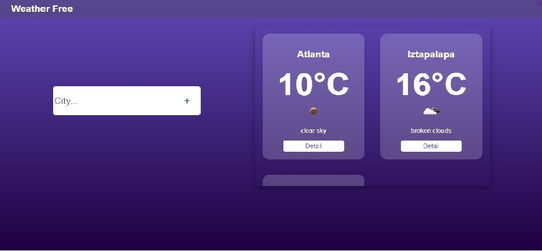
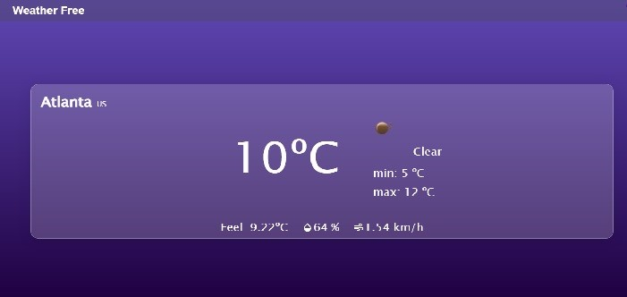

# Weather App

This mini project consists of using the react library, to make an app that can search for a city and obtain weather information (temperature, maximum temperature, minimum temperature, thermal sensation, humidity, speed of time) these data are obtained from the API https ://openweathermap.org/

# Landing page

Initially a Landing page will be displayed welcoming the user, it contains a button to enter.

# Main page

This is the main page which contains a search input and shows some cards with basic information about each city.

# Detail Page

This is the detail page of each city, it shows more information about the current weather.
